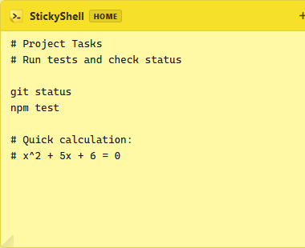
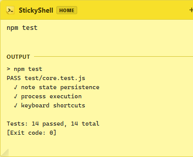
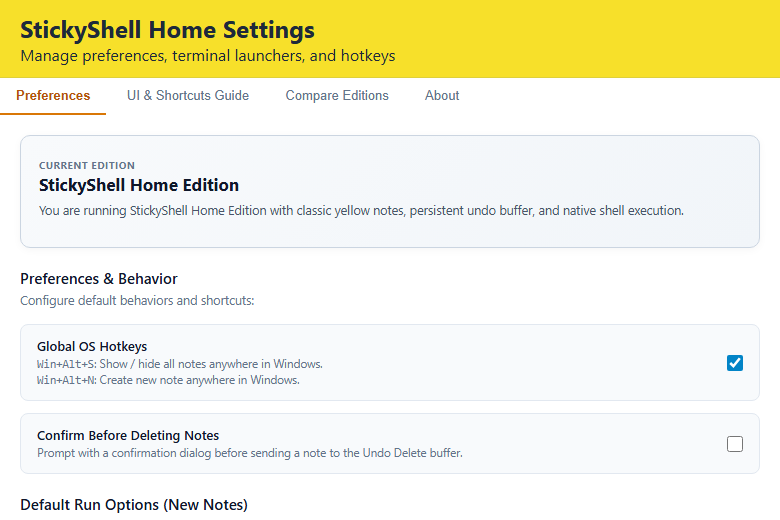

# StickyShell Home

A desktop sticky note application that allows you to write notes and run shell commands directly from your desktop. Built with Tauri v2, Rust, and standard web technologies.

---

## Downloads (v1.1.0)

Pre-built binaries are available for Windows, macOS, and Linux:

| Platform | Package | Architecture | Download Link |
| :--- | :--- | :--- | :--- |
| Windows | Setup Installer (.exe) | 64-bit (x64) | [Download Setup (.exe)](../../releases/latest) |
| Windows | MSI Package (.msi) | 64-bit (x64) | [Download MSI (.msi)](../../releases/latest) |
| macOS | Disk Image (.dmg) | Universal (Apple Silicon & Intel) | [Download DMG (.dmg)](../../releases/latest) |
| Linux | Debian Package (.deb) | 64-bit (amd64) | [Download DEB (.deb)](../../releases/latest) |
| Linux | AppImage | 64-bit (x86_64) | [Download AppImage](../../releases/latest) |

You can also find all release files on the [GitHub Releases](../../releases) page.

### Package Managers

#### Scoop (Windows)

Install directly via the manifest URL:
```powershell
scoop install https://raw.githubusercontent.com/RadnusD/stickyshell-home/main/bucket/stickyshell.json
```

---

## Screenshots

| Note Scratchpad | Inline Command Output | Settings & Preferences |
| :---: | :---: | :---: |
|  |  |  |

---

## Features

- Multi-Line Block Execution: Run single commands or multi-line shell scripts directly from your note.
- Dual Execution Modes:
  - Inline Capture (Ctrl + Enter): Runs commands quietly and captures stdout/stderr in an expandable output drawer.
  - External Console (Ctrl + Shift + Enter): Opens a native interactive terminal window (CMD, PowerShell, or Bash).
- Always on Top: Pin any note to keep it floating above other active windows.
- Custom Working Directories: Configure specific working directories per note, or default to your user profile directory.
- Start on Startup: Optional toggle in settings to launch StickyShell when your computer boots.
- 100% Offline: Notes and settings are stored locally on your machine in standard JSON format. No cloud sync, no tracking, and no external network calls.

---

## Building from Source

If you prefer to inspect the source code and compile the application yourself, you can build it in a few steps.

### Prerequisites

- Node.js (version 18 or higher)
- Rust and Cargo (latest stable release from https://rustup.rs)
- Platform-specific build tools:
  - Windows: Visual Studio C++ Build Tools and WebView2 (pre-installed on Windows 10/11)
  - Linux: `libwebkit2gtk-4.1-dev`, `build-essential`, `curl`, `wget`, `file`, `libssl-dev`, `libayatana-appindicator3-dev`, `librsvg2-dev`
  - macOS: Xcode Command Line Tools (`xcode-select --install`)

### Build Steps

1. Clone the repository:
   ```bash
   git clone https://github.com/RadnusD/stickyshell-home.git
   cd stickyshell-home
   ```

2. Install frontend dependencies:
   ```bash
   npm install
   ```

3. Run in development mode:
   ```bash
   npm run dev
   ```

4. Compile production binaries and installers:
   ```bash
   npm run build
   ```

The compiled binaries and installer packages will be located in:
`src-tauri/target/release/bundle/`

---

## Antivirus and Safety Information

### Windows SmartScreen and Antivirus Detection Context

StickyShell Home is an open-source desktop utility that executes local shell commands on request. Release binaries are not signed with a paid Microsoft Authenticode certificate.

When running newly released binaries on Windows:
- Windows SmartScreen may show an "Unknown Publisher" or "Windows protected your PC" dialog. To run the application, click **More info** and then click **Run anyway**.
- A small number of machine-learning antivirus heuristics may flag the installer because it is unsigned and has the capability to spawn terminal processes (`cmd.exe`, `powershell.exe`).

### VirusTotal Inspection Report

The installer binary has been analyzed on VirusTotal:
- **Scan Report**: [VirusTotal Inspection (SHA-256: 60c7a199c...)](https://www.virustotal.com/gui/file/60c7a199c1a5eb1024372f23948dc08faef4fd2c0d48bd49f5448b15e041b55f/)
- **Detection Results**: 69+ security vendors (including Microsoft Defender, Kaspersky, Bitdefender, Malwarebytes, CrowdStrike, SentinelOne, and Symantec) report 0 threats.
- **Heuristic Notes**: The 2 machine-learning flags (Cylance "Unsafe", APEX "Malicious") classify unsigned command-execution utilities as Potentially Unwanted Applications (PUA) by policy, not malicious payloads.

StickyShell Home is completely open source and runs 100% offline without network connections or telemetry. You can inspect the source code in this repository or build the binaries from scratch using the build instructions above.

### Code Signing Notice

Free code signing provided by [SignPath.io](https://signpath.io), certificate by [SignPath Foundation](https://signpath.org).

### SHA-256 Checksums (v1.1.0)

| Platform | File | SHA-256 Checksum |
| :--- | :--- | :--- |
| Windows | `StickyShell.Home_1.1.0_x64-setup.exe` | `60C7A199C1A5EB1024372F23948DC08FAEF4FD2C0D48BD49F5448B15E041B55F` |
| Windows | `StickyShell.Home_1.1.0_x64_en-US.msi` | `8FDAF5FDD31F13553941DBE8EF2AF44F4772A7EEBDC942E9B72350F276C785EE` |
| macOS | `StickyShell.Home_1.1.0_universal.dmg` | `0A1757D8BBB8BEADF41731C5BBB55ED3778A2D257044C9F4F70204112984C350` |
| Linux | `StickyShell.Home_1.1.0_amd64.deb` | `54ABCCC1F4F4D6FDDFE9D3076B0D7470641A6CB8D4D2AE691D2D53F45BDD75FC` |
| Linux | `StickyShell.Home_1.1.0_amd64.AppImage` | `6D6DF2BCFAE6D53A5715D9ACCBB48DBC73063304836DC6C76C6DEF8F2502E4EF` |
| Linux | `StickyShell.Home-1.1.0-1.x86_64.rpm` | `40C3631D3A9F4D53B2E0F02E6E62FA2C106840FE1F6E809B8E920E544C0E402B` |

---

## Keyboard Shortcuts

| Shortcut | Action |
| :--- | :--- |
| Win + Alt + S | Show or hide all sticky notes |
| Win + Alt + N | Create a new sticky note |
| Ctrl + Enter | Run note content (Inline Capture) |
| Ctrl + Shift + Enter | Run note content (External Console) |

---

## Local Storage Locations

All user notes and application settings are kept entirely on your local machine:

- Windows: `%APPDATA%\com.stickyshell.home\stickyshell_data.json`
- macOS: `~/Library/Application Support/com.stickyshell.home/stickyshell_data.json`
- Linux: `~/.config/com.stickyshell.home/stickyshell_data.json`

---

## StickyShell Pro (In Development)

A Pro edition of StickyShell is currently under active development. Upcoming features include multi-tab notes, persistent session management, environment variable presets, and customizable hotkey macros.

---

## Support and Feedback

If you encounter an issue or have a suggestion:
- Check existing discussions or submit a report on our [Issues Tracker](../../issues).

---

## License

Copyright (c) 2026 StickyShell / RadnusD. All rights reserved.
See [LICENSE](LICENSE) for details.
